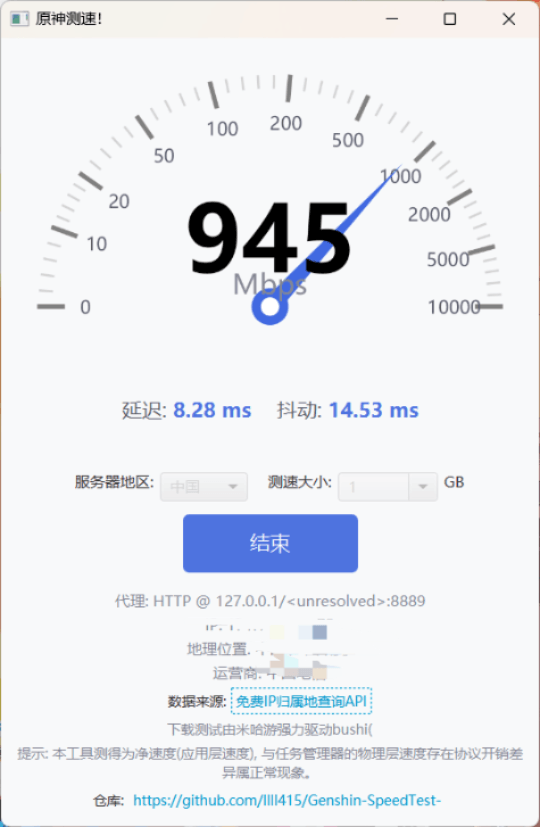
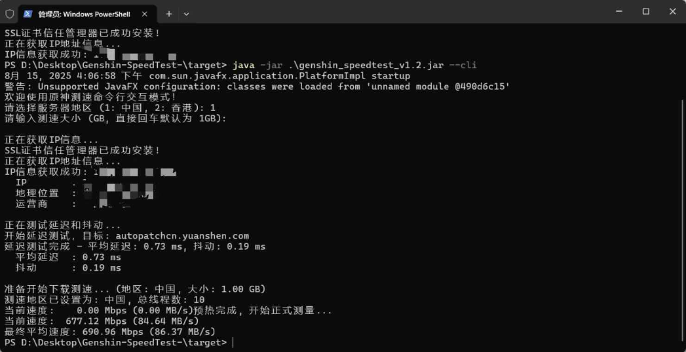

# Genshin-SpeedTest-

一个基于 JavaFX 的编写的原神网络测速工具

本项目是一个简单的桌面应用程序，通过下载原神/绝区零的包进行测速




## ✨ 主要功能

- **实时速度表盘**: 直观地展示当前下载速度
- **服务器地区选择**: 支持在不同地区的服务器节点之间切换
- **延迟与抖动测试**: 在下载测速开始前，会先进​​行Ping测试以评估网络稳定性
- **IP信息查询**: 自动获取并显示用户的公网IP、地理位置及运营商
- **系统代理支持**: 能自动检测并使用系统设置的代理进行所有网络测试

## 🚀 如何编译 (使用 Maven)

### **环境要求**

在开始之前，请确保您的开发环境中已安装以下软件：

- **JDK 17** 或更高版本
- **Maven**

### **编译步骤**

1.  **克隆本仓库**
    打开终端或命令行工具，使用 `git` 克隆项目到本地
    ```bash
    git clone https://github.com/lll415/Genshin-SpeedTest-.git
    ```

2.  **进入项目目录**
    ```bash
    cd Genshin-SpeedTest-
    ```

3.  **使用 Maven 打包**
    在项目根目录下，运行以下命令Maven 会自动处理所有依赖项、编译代码，并将其打包成一个可执行的 "fat" JAR 文件
    ```bash
    mvn clean package
    ```

4.  **运行程序**
    命令成功执行后，您会在 `target` 文件夹内找到一个 JAR 文件 (例如 `SpeedTestApp-1.0.0.jar`)

    通过以下命令即可启动应用程序(图形化模式)：
    ```bash
    java -jar SpeedTestApp-1.0.0.jar
    ```
    命令行交互模式 添加 --cli
    ```bash
    java -jar SpeedTestApp-1.0.0.jar --cli
    ```
## ⭐ 致谢
* **[免费IP归属地查询API:https://www.ip9.com.cn](https://www.ip9.com.cn)**
* **原神/绝区零 提供下载包**
## 📄 许可证

本项目基于 [MIT License](LICENSE) 授权